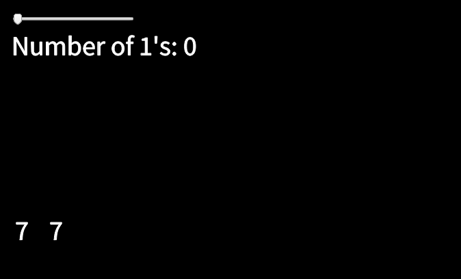

From Professor Stewart's Hoard of Mathematical Treasures book:

## Calculator Curiosity 1

Get your calculator, and work out:

(8×8) + 13

(8×88) + 13

(8×888) + 13

(8×8888) + 13

(8×88888) + 13

(8×888888) + 13

(8×8888888) + 13

(8×88888888) + 13

# Challenge
So, here's the challenge. How to do that math 
in the most functional way possible using 
javascript.
And later on, try to figure out
a good visual way to show the math result using 
p5.js library.

# Results and some observations
The result obtained was a page with a slider that increments 
the number of 8's to do the math.

The interesting thing here is that the result is a 
series 
of numbers that has a pattern.
It starts with the number 7, followed by 1's
and then finally the number 7. So, if you set the slider to
0 you get 

**77**

If you set to 1 you get

**717**

Then if you set to 2 you get

**7117**

And so on...

However that pattern just goes until you get 
fourteen 1's. After that the series gets
messy.